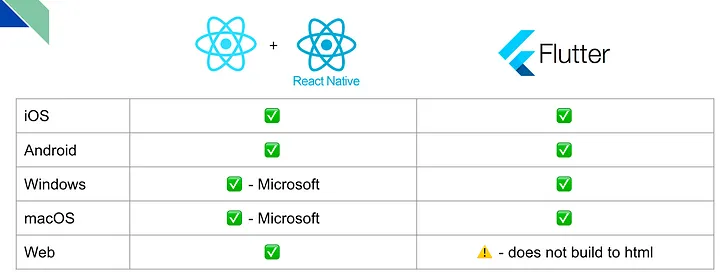

<!-- omit in toc -->
# Flutter vs React Native 2023: A guide from every experience level

> Which cross-platform framework should you choose as a junior dev, senior dev and CTO? (Updated Nov 2023)

- [1. Introduction](#1-introduction)
- [2. An overview of Flutter and React Native](#2-an-overview-of-flutter-and-react-native)
  - [2.1. Platforms supported by Flutter and React Native](#21-platforms-supported-by-flutter-and-react-native)
  - [2.2. Languages used by Flutter and React Native](#22-languages-used-by-flutter-and-react-native)
  - [2.3. UI components used by Flutter and React Native](#23-ui-components-used-by-flutter-and-react-native)
- [3. Flutter vs React Native as a Junior Dev](#3-flutter-vs-react-native-as-a-junior-dev)
- [4. Flutter vs React Native as a Senior Dev](#4-flutter-vs-react-native-as-a-senior-dev)
- [5. Flutter vs React Native as a CTO](#5-flutter-vs-react-native-as-a-cto)
- [6. Use Cases](#6-use-cases)
  - [6.1. I want to build an app for mobile, desktop and the web with SEO (e.g. Medium, Reddit)](#61-i-want-to-build-an-app-for-mobile-desktop-and-the-web-with-seo-eg-medium-reddit)
  - [6.2. I want to build an app for mobile, desktop and web (e.g. Spotify)](#62-i-want-to-build-an-app-for-mobile-desktop-and-web-eg-spotify)
  - [6.3. I want to build an app for mobile, and I want native behaviour (e.g. native scrolling, fancy iOS components)](#63-i-want-to-build-an-app-for-mobile-and-i-want-native-behaviour-eg-native-scrolling-fancy-ios-components)
- [7. Conclusion](#7-conclusion)
- [8. Resources](#8-resources)

## 1. Introduction
If you’re reading this article you’ve probably decided to use a cross-platform framework over native development. Cross-platform frameworks allow you to deploy to multiple platforms from a single codebase, which has two benefits:

- Cost and time savings
- Consistency in UX/UI

The two main contenders in the cross-platform framework space are Flutter and React Native, and in the following sections, we will discuss the tradeoffs of each framework from the perspective of a junior dev, senior dev and a CTO.

If you are a CTO choosing Flutter or React Native to develop your company’s product, I strongly recommend that you read through the sections for junior devs and senior devs as well. This will help you understand the lower-level implications of each framework, and how it will affect the quality and speed at which your product will be developed.

## 2. An overview of Flutter and React Native
React Native is an open-source mobile application framework created by Facebook. It was released in March 2015 and has become one of the most popular frameworks for mobile app development.

Flutter is an open-source UI software development kit created by Google. It was first introduced in May 2017 and has quickly gained popularity in the developer community.

### 2.1. Platforms supported by Flutter and React Native
Both frameworks allow you to deploy to iOS, Android, Web, MacOS and Windows, but there are platform-specific considerations that should be noted:

<figure>
  
<figcaption style="text-align: center; font-size: smaller;">Platforms supported by Flutter and React Native</figcaption>
</figure>

Flutter supports all platforms out of the box, but there is a key limitation with deploying to the web — Flutter does not build to HTML.

React Native on the other hand, supports all platforms, but you’ll need to use Microsoft’s (third-party) packages to build to Windows and macOS, which adds complexity to your toolchain.

### 2.2. Languages used by Flutter and React Native

Flutter uses the Dart programming language, which is also developed by Google. Dart has sound typing, which is a technical feature that brings different benefits to devs and management alike.

React Native uses JavaScript, which has a rich history in web development and extensive online resources. It can be combined with TypeScript to provide static typing, and

### 2.3. UI components used by Flutter and React Native
Flutter comes with a rich set of pre-designed widgets that follow specific design languages, such as Material Design and Cupertino. These widgets help in creating visually appealing and “natively behaving” apps for both Android and iOS platforms. However, you can also create your own design systems with highly composable widgets.

React Native uses native components as building blocks, and as a result, provides the look, feel, and performance of native applications.

## 3. Flutter vs React Native as a Junior Dev

As a junior dev, your main responsibility is usually to bring value to users with the code you create. You may be inexperienced with the tools and frameworks, so the question on your mind may be:

> Which framework can provide the best developer experience (DevX) so that I can deliver value to users as quickly as possible?

The key advantages of each framework are:

- Flutter excels at out-of-the-box DevX and a simple toolchain.
- React Native excels at the amount of resources and job opportunities available.

You can dive into the details in the following article: *"Flutter vs React Native 2023: From the perspective of a junior dev"*

## 4. Flutter vs React Native as a Senior Dev

As a senior dev, you may still be coding — but things like developer experience may become less important to you now since you have acquired the skills, knowledge and tools to work around any setbacks in DevX. Instead, the question you might be asking is:

> How can the framework help my team work faster and smarter?

The key advantages of each framework are:

- Flutter excels at dependency injection, E2E testing and UI standardisation.
- React Native excels in the amount of resources, OTA updates and the use of native components.

You can dive into the details in the following article: *"Flutter vs React Native 2023: From the perspective of a senior dev"*

## 5. Flutter vs React Native as a CTO

As a CTO, what are the tradeoffs between Flutter and React Native?
Some questions you may be more concerned about:

> Does the framework have the features we need to achieve the business goal?
>
> What can each framework do to help us achieve the goal with the least amount of resources?

The key advantages of each framework are:

- React Native excels in the amount of resources and web support.
- Flutter excels in complex UI and standardisation.

You can dive into the details in the following article: *"Flutter vs React Native 2023: From the perspective of a senior dev"*

## 6. Use Cases
In this section, we will go through a set of potential scenarios and my recommendations. The previous sections should help to trigger bells in your head as we go through each scenario and list down questions which need to be considered.

### 6.1. I want to build an app for mobile, desktop and the web with SEO (e.g. Medium, Reddit)
If you are looking to build an app like Medium, where a large portion of the content in the app needs to be crawlable, React Native may be the more attractive choice.

The options on the table are:

React Native for desktop and mobile, NextJS for web
React Native for desktop, mobile and web.
Flutter for mobile and desktop, NextJS for web
React Native + NextJS: One of the best ways you can improve SEO is to use a server-side rendering framework like NextJS. While React Native is not directly portable to NextJS, the fact that they are both JS frameworks means that you can share components between them. With that in mind, you’ll probably only need React devs to build and maintain your React Native app and NextJS website.

React Native only: Using React Native for all platforms will allow you to maintain design and functional consistency between your web, desktop and mobile applications, but at the expense of some sub-optimal SEO.

Flutter + NextJS: This will allow you to adhere to SEO best practices while reaping the benefits of Flutter. However, this would mean that you would need a team capable of developing in both frameworks.

Questions you should ask yourself before deciding:

How much code needs to be shared between mobile/desktop and web?
What needs to be SEOed, and to what extent?
What are the skill sets of my team?
What functionalities will the app require, and are there existing libraries for it?
How complex is the application I am building?
### 6.2. I want to build an app for mobile, desktop and web (e.g. Spotify)
If you are looking to build an app like Spotify, where one of your success criteria is to maintain consistent UI and UX across platforms and SEO is not as important, then Flutter may be the more attractive choice.

The options on the table are:

Flutter for mobile, desktop and web app, NextJS for website
React Native for mobile, desktop and web, NextJS for website
Flutter + NextJS: Using Flutter for the application experience, and NextJS for the landing page allows you to avoid all the platform and device-specific bugs associated with using native components in React Native. Developing the website in NextJS keeps it SEO-friendly while still allowing you to embed the Flutter web app as an SPA if need be.

React Native + NextJS: Using React Native allows you to share design elements with the Next website, saving on design costs.

Questions you should ask yourself before deciding:

How much of the design elements can be shared between the React Native app and the NextJS website, and how much resources will that save?
What are the skill sets of my team?
What functionalities will the app require, and are there existing libraries for it?
### 6.3. I want to build an app for mobile, and I want native behaviour (e.g. native scrolling, fancy iOS components)
If you are looking to build an app where your target users are sensitive to non-native behaviour, e.g. scrolling, then React Native may be the more attractive choice.

The options on the table are:

React Native for iOS and Android
Flutter for iOS and Android
Using React Native will allow you to tap into the look and behaviour of native components in iOS and Android. Additionally, iOS components are known to be fancy and performant, which is an added bonus.

While using Flutter will not give you the same native look and feel on iOS, it can bring significant advantages to Android, because there are quite a few Android variants where native UI elements can sometimes behave unpredictably. In such cases, Flutter provides a level of consistency that might be hard to achieve with React Native or even native Android development.

Questions you should ask yourself before deciding:

How many Android platforms am I targeting, and how complex is the UI? Will the benefits of using native components in Android outweigh the visual bugs that may arise?
What are the skill sets of my team?
What functionalities will the app require, and are there existing libraries for it?

## 7. Conclusion
There is no best framework, only tradeoffs which you need to balance for your use case. This guide will likely evolve throughout the upcoming months, so stay tuned! If you have any further questions, feel free to reach out!

Big shoutout to

Mo Javad, Head of Mobile @ Theodo UK, for his recommendations on how I should structure this article from different perspectives.
Guillaume Diallo Boisgard for sharing his experience as Head of Flutter @ BAM
Matthieu Perenelle for sharing his insights from becoming a Flutter developer after working with React Native @ BAM
And also my cousin for introducing dependency injection to me :)
Disclosure: I’ve tried to write this article as objectively as I can, but I am not omniscient nor completely unbiased (I started my dev journey with Flutter). Please leave a comment if you feel like this article is missing key points of debate, so that we can have more insightful discussions to grow both communities and potentially shape the frameworks into their niches :)

## 8. Resources
Other related articles I have written:

Implementing the DRVVM model in Flutter
Mastering App Architecture in Flutter
Other resources you might find interesting:

Apps using Flutter
Apps using React Native
Roadmap for Flutter
Kotlin Multiplatform