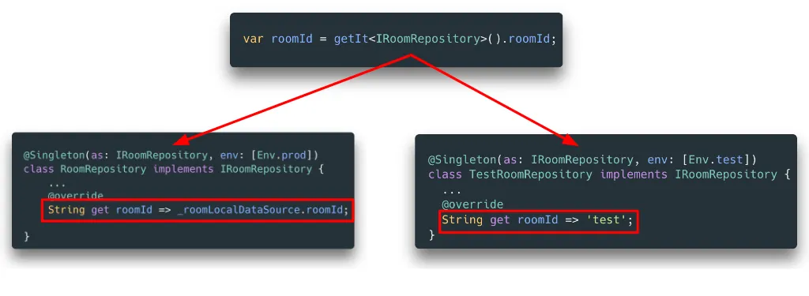
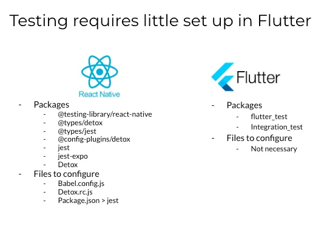

<!-- omit in toc -->
# Flutter vs React Native Dec 2023: As a senior dev
<!-- VARIABLE:REFER_TO_MAIN_ARTICLE_INTRO -->
> This article is a subset of the main article, [Flutter vs React Native Dec 2023: A guide from every experience level](../0-main/react-native-vs-flutter.md), which is a high level comparison of Flutter and React Native from different experience levels and some use cases. This article goes into detail on the differences between Flutter and React Native from a senior developer’s perspective, and is meant to support the main article.

- [1. As a Senior Dev, what are the tradeoffs between Flutter and React Native?](#1-as-a-senior-dev-what-are-the-tradeoffs-between-flutter-and-react-native)
- [2. Flutter Wins: Dependency Injection, E2E testing, UI standardisation](#2-flutter-wins-dependency-injection-e2e-testing-ui-standardisation)
  - [2.1. Flutter has robust Dependency Injection (DI) tools](#21-flutter-has-robust-dependency-injection-di-tools)
  - [2.2. E2E testing works out of the box with Flutter](#22-e2e-testing-works-out-of-the-box-with-flutter)
  - [2.3. Flutter standardises UI behaviour on different platforms and devices](#23-flutter-standardises-ui-behaviour-on-different-platforms-and-devices)
    - [2.3.1. Flutter provides consistent shader and text performance between iOS and Android](#231-flutter-provides-consistent-shader-and-text-performance-between-ios-and-android)
    - [2.3.2. Flutter provides predictable keyboard management between iOS and React Native](#232-flutter-provides-predictable-keyboard-management-between-ios-and-react-native)
    - [2.3.3. Visual bugs in Flutter are not platform or device-dependent](#233-visual-bugs-in-flutter-are-not-platform-or-device-dependent)
- [3. React Native Wins: Packages and native components](#3-react-native-wins-packages-and-native-components)
  - [3.1. There are more JS packages than Dart packages](#31-there-are-more-js-packages-than-dart-packages)
- [4. Conclusion](#4-conclusion)

## 1. As a Senior Dev, what are the tradeoffs between Flutter and React Native?

As a senior dev, factors such as developer experience may become less important since you have acquired the skills, knowledge and tools to work around DevX hurdles. Instead, the questions you may be concerned about are:

> - How can the framework help my team work faster and smarter?
<!-- > - Which framework will have more job stability so that I can support my dependents?
> - Which framework has a higher skill ceiling so that I can continue to grow as a developer?
> - Which framework is more likely to be used in the future? -->

## 2. Flutter Wins: Dependency Injection, E2E testing, UI standardisation
### 2.1. Flutter has robust Dependency Injection (DI) tools

There are several dependency injection tools you can use in Flutter which allow you to provide classes with their dependencies automatically (think React Native’s Contexts API but on steroids). Dependency injection is critical for keeping code loosely coupled and promoting testability, and DI tools can help to reduce boilerplate and dev time in setting it up.

<figure>

<figcaption style="text-align: center; font-size: smaller;">An example of Dependency Injection in Flutter using injectable, where a roomId (dependency) is resolved to a getter or constant depending on whether env is set to prod or test.
</figcaption>
</figure>

This is not to say that dependency injection is not possible in React Native or JS:

- [InversifyJS](https://github.com/inversify/InversifyJS) is a widely used dependency injection tool, although you might find some bugs trying to use it with Expo.
- Manual dependency injection is also possible with React.useContext ([see code example](https://github.com/juskek/app_architecture/blob/main/react-native-android-architecture/src/data/shared-counter/ISharedCounterRepository.ts)). The only expense to this approach is the cognitive load needed to manually implement this.

### 2.2. E2E testing works out of the box with Flutter

The following image shows the difference in the number of packages and files you need to configure in React Native and Flutter.

<figure>

<figcaption style="text-align: center; font-size: smaller;">Testing is easier to set up in Flutter
</figcaption>
</figure>

There are fewer packages to install and files to configure — most of what you need works out of the box in Flutter, which reduces set-up time when starting new projects. Additionally, fewer dependencies also mean that testing bugs are easier to resolve, and because Flutter tests run in the same environment as the main app, you don’t get node version issues.

<figure>
  
  <figcaption style="text-align: center; font-size: smaller;">
    Example of E2E tests on Flutter running interactively between multiple devices.
  </figcaption>
</figure>

### 2.3. Flutter standardises UI behaviour on different platforms and devices

Because Flutter uses its own rendering engine and canvas, there are certain advantages that it has over React Native, which uses native components.

#### 2.3.1. Flutter provides consistent shader and text performance between iOS and Android

Native Android text and shader components are less feature-rich and more buggy as compared to iOS, so this can result in inconsistencies in components between iOS and Android when using React Native.

#### 2.3.2. Flutter provides predictable keyboard management between iOS and React Native

Keyboard handling is notoriously difficult in React Native. While Android and iOS provide several tools and approaches to manage keyboard interactions, there is variability and inconsistency across different devices and versions. Combining this with poor React Native documentation means that trying to implement basic behaviour can get hacky.

Flutter provides a single, consistent API for keyboard management, which is well-documented and easy to use. This means that developers can spend less time debugging and more time building features. However, this can be a double-edged sword, as it can lead to some non-functioning edge cases, e.g. double tapping does not select text on iOS.

#### 2.3.3. Visual bugs in Flutter are not platform or device-dependent

Because Flutter uses its own rendering engine to draw UI components, bugs that occur are also not device or platform-dependent. This uniformity is a significant advantage, especially when dealing with a diverse ecosystem of Android devices with varying characteristics. Developers can be more confident that a UI that looks and works well on one device will look and work similarly on another, reducing the time and resources spent on debugging and testing across multiple devices.

## 3. React Native Wins: Packages and native components
### 3.1. There are more JS packages than Dart packages

As mentioned before, the number of JS packages far outnumber Dart packages. This not only includes packages contributing to user features but developer packages as well, e.g. env var syncing, code generators.

## 4. Conclusion
<!-- VARIABLE:INDIVIDUAL_PERSPECTIVE_CONCLUSION -->
We've covered the differences between Flutter and React Native from a senior developer's perspective, which can be summarised as:

<!-- VARIABLE:SENIOR_DEV_SUMMARY -->
- Flutter excels at dependency injection, E2E testing, and UI standardisation, which will help your team work more efficiently.
- React Native excels in the amount of packages available, which means someone else has probably already solved the problem you are facing, saving dev time.

<!-- VARIABLE:REFER_TO_MAIN_ARTICLE_CONCLUSION -->
If you're interested in learning more about the differences between Flutter and React Native from different experience levels, as well as some use cases for each framework, check out the main article, [Flutter vs React Native Dec 2023: A guide from every experience level](../0-main/react-native-vs-flutter.md).

