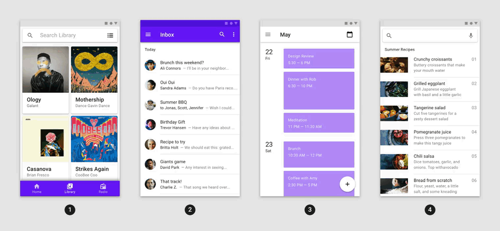
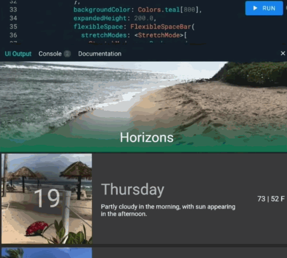
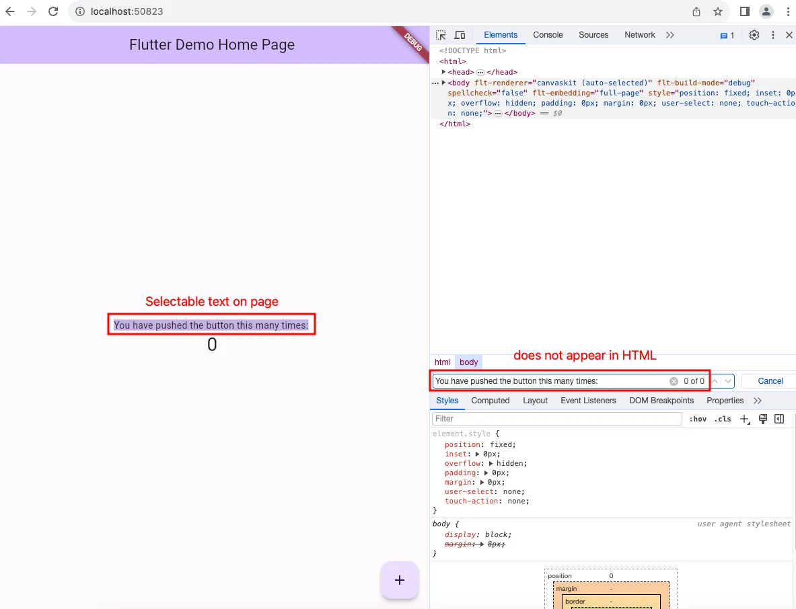
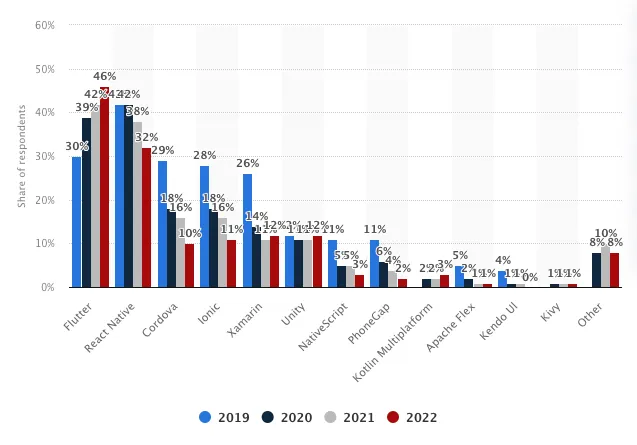
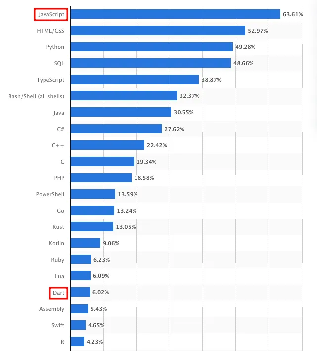

<!-- omit in toc -->
# Flutter vs React Native 2023: As a CTO

> Which cross-platform framework should you choose as a junior dev, senior dev and CTO? (Updated Nov 2023)

- [1. Flutter Wins: Complex UI and standardisation](#1-flutter-wins-complex-ui-and-standardisation)
  - [1.1. Flutter allows you to create highly complex UI, animations and design systems](#11-flutter-allows-you-to-create-highly-complex-ui-animations-and-design-systems)
  - [1.2. Flutter standardises UI behaviour on different platforms and devices](#12-flutter-standardises-ui-behaviour-on-different-platforms-and-devices)
- [2. React Native Wins: Resources, OTA updates and web support](#2-react-native-wins-resources-ota-updates-and-web-support)
  - [2.1. There are more JS packages than Dart packages](#21-there-are-more-js-packages-than-dart-packages)
  - [2.2. You can push updates over the air with React Native](#22-you-can-push-updates-over-the-air-with-react-native)
  - [2.3. Flutter Web SEO is lacking](#23-flutter-web-seo-is-lacking)
  - [2.4. There are more React Native experts](#24-there-are-more-react-native-experts)

## 1. Flutter Wins: Complex UI and standardisation
### 1.1. Flutter allows you to create highly complex UI, animations and design systems

Flutter’s ability to deliver complex UI and animations stems from the comprehensive set of widgets it offers. Flutter provides a whole suite of built-in animations, which can be controlled and configured to suit your specific needs.

<figure>

<figcaption style="text-align: center; font-size: smaller;">Flutter has a wide range of built-in animations which can be configured to suit your specific needs. (Source)
</figcaption>
</figure>
You can also create code-based animations for more complex visuals, such as the following radar chart.

<figure>

<figcaption style="text-align: center; font-size: smaller;">Flutter provides a framework to create code-based animations like in d3js (Source)
</figcaption>
</figure>

Even more complex animations with interactivity can also be implemented due to integrations with Lottie and Rive.

<figure>

<figcaption style="text-align: center; font-size: smaller;">Flutter + Rive allows you to create complex, interactive animations (Source)
</figcaption>
</figure>

<figure>

<figcaption style="text-align: center; font-size: smaller;">Implementing complex scroll animations is a breeze in Flutter (Source)
</figcaption>
</figure>

The reason why Flutter excels in creating complex animations is because it essentially gives you a large canvas to render everything on to pixel-perfect accuracy. However, this approach comes with its own set of challenges, and one of the biggest concerns is SEO, which we will discuss in the next section.

(Source)
### 1.2. Flutter standardises UI behaviour on different platforms and devices

As mentioned before, because Flutter uses its own rendering engine and canvas, there are two key advantages:

Consistent UI and UX across all platforms and devices can help to maintain brand image
Fewer resources spent on fixing platform and device-dependent bugs

## 2. React Native Wins: Resources, OTA updates and web support
### 2.1. There are more JS packages than Dart packages

To reiterate this again, the number of JS packages far outnumber Dart packages. This is also important from the perspective of a CTO because if your app requires some kind of package which will take a long time to develop in Dart, Flutter may be a deal breaker.

### 2.2. You can push updates over the air with React Native

One of the significant advantages of using React Native for mobile app development is the ability to push updates over the air (OTA). This feature allows developers to update their apps without going through the traditional app store approval and release process. This brings several benefits:

Bug fixes, small tweaks, rollbacks and new features can be deployed rapidly
Users get updates as soon as they open the app, without needing to manually go to the app store
While powerful, OTA updates have limitations. Major changes, especially or adding new permissions, still require a traditional app store release.

### 2.3. Flutter Web SEO is lacking

If you think that React SPAs are bad for SEO, think again. Flutter SPAs have notoriously bad SEO, and the docs even recommend that you should avoid trying to use Flutter Web if you have content that needs to be optimised for search engines:

> In general, Flutter is geared towards dynamic application experiences. Flutter’s web support is no exception. Flutter web prioritizes performance, fidelity, and consistency. This means application output does not align with what search engines need to properly index. For web content that is static or document-like, we recommend using HTML — just like we do on flutter.dev, dart.dev, and pub.dev. You should also consider separating your primary application experience — created in Flutter — from your landing page, marketing content, and help content — created using search-engine optimized HTML.

<figure>

<figcaption style="text-align: center; font-size: smaller;">SEO does not work with Flutter because everything is painted on a canvas object
</figcaption>
</figure>

The problem with SEO in Flutter is due to the usage of canvas objects to render content (this video has a visual explanation of the issue). Regardless of whether you use the HTML or CanvasKit renderer, Flutter will still render your content in a <canvas/> container, which means that search engine crawlers will not be able to see your content.

While React Native SPAs are not the optimal approach to SEO, they are at least still supported by Google crawlers. You get the benefit of having a universal app that works on both web and mobile, and if you are using Metro to compile to web, you get added SEO support.

### 2.4. There are more React Native experts

As mentioned before, Flutter has not been around as long as React and JS, which can be an issue when looking to hire Flutter devs. Although Flutter has been seeing a steady increase in adoption rate, an important factor to consider is the experience level of the market.

<figure>

<figcaption style="text-align: center; font-size: smaller;">Cross-platform mobile frameworks used by software developers worldwide from 2019 to 2022 (Source: Statista)
</figcaption>
</figure>

JavaScript has been a cornerstone of web development for decades, leading to a vast pool of developers who are familiar with it. React, introduced by Facebook in 2013, quickly became popular for building dynamic web applications, further expanding the JavaScript developer community. This long-standing presence can mean that there are more experienced developers and established best practices in the React and JavaScript ecosystem, and by extension React Native.

On the other hand, Flutter is relatively new in the market and Dart is less known compared to JavaScript — which can contribute to a lower concentration of Flutter experts when you are looking to hire.

<figure>

<figcaption style="text-align: center; font-size: smaller;">Most used programming languages among developers worldwide as of 2023 (Source: Statista)
</figcaption>
</figure>

